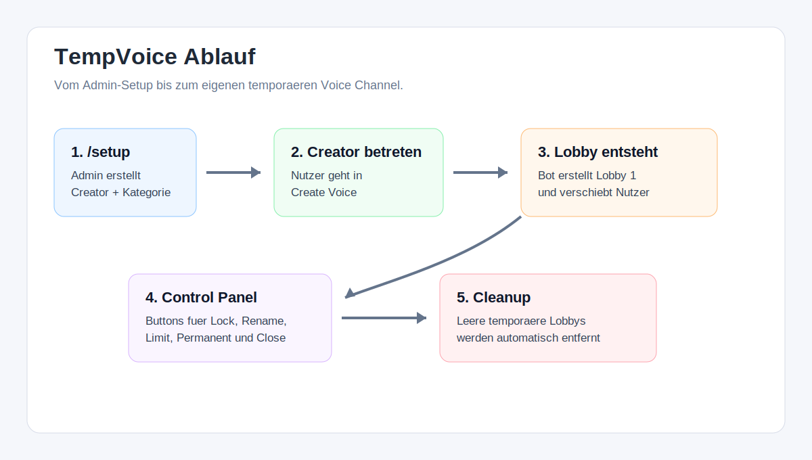
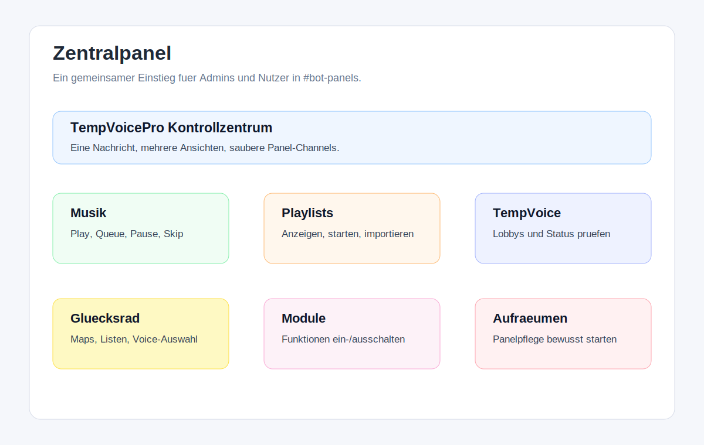
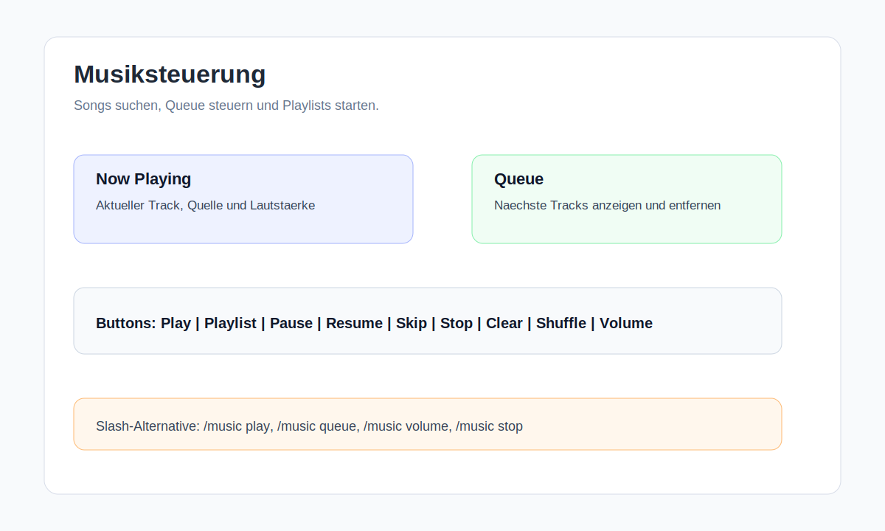
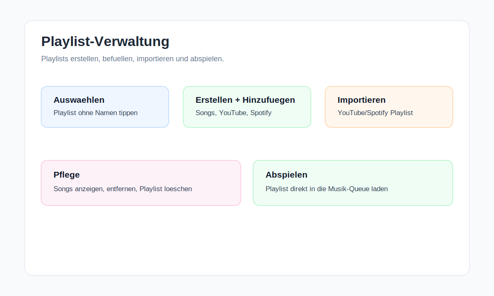
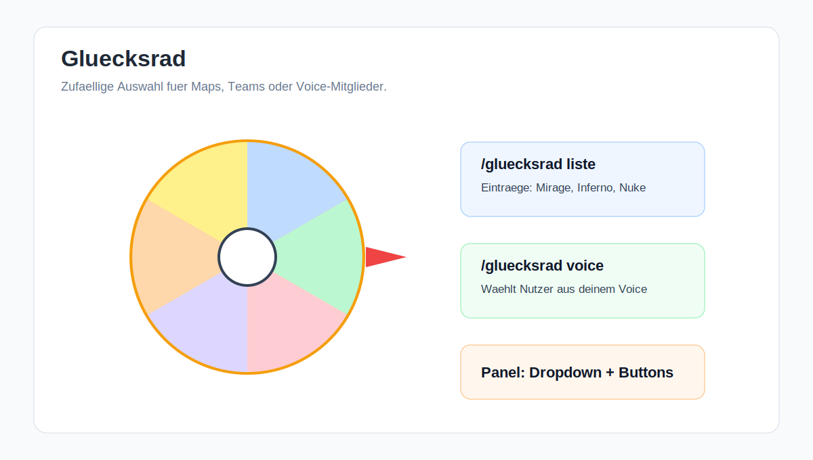
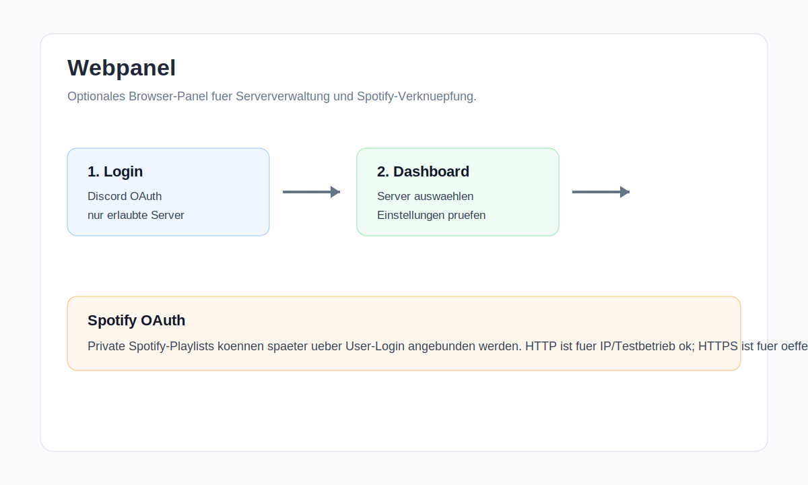
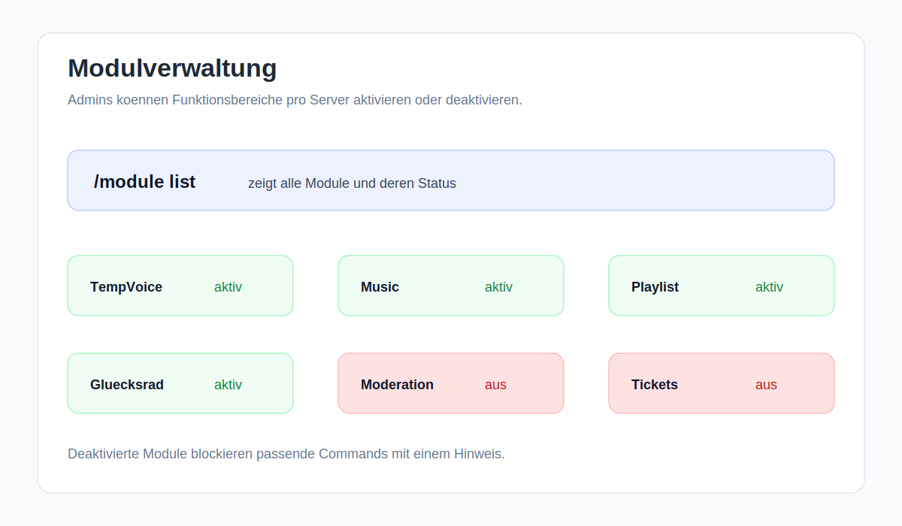
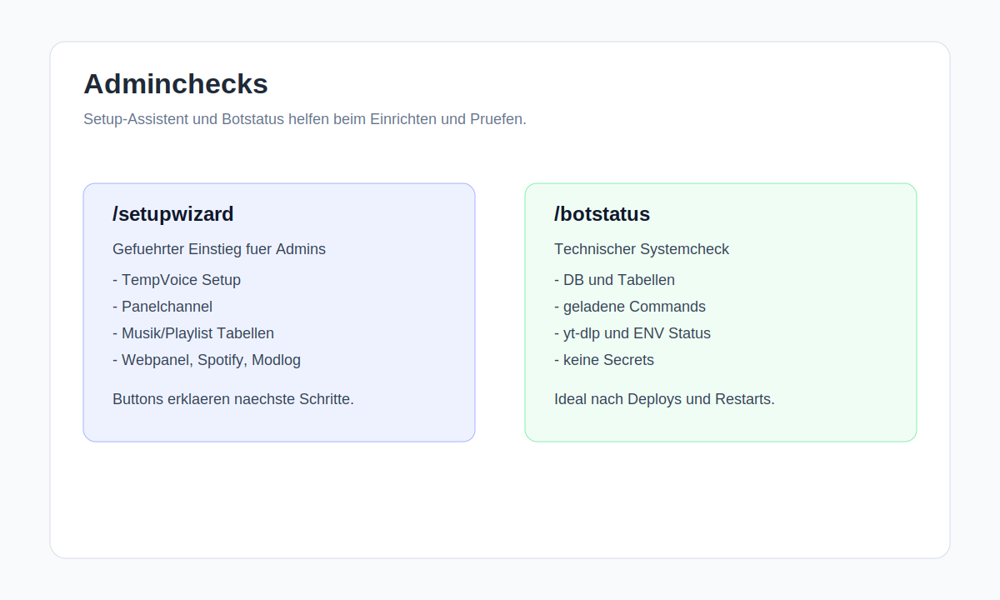

# TempVoicePro Benutzerhandbuch

Dieses Handbuch erklaert TempVoicePro fuer Administratoren, Moderatoren und normale Nutzer.
Es enthaelt keine Tokens, Passwoerter oder geheimen `.env`-Werte.

## Schnellstart

### Fuer Administratoren

1. Bot auf den Server einladen und sicherstellen, dass er die noetigen Rechte hat.
2. `/setupwizard` ausfuehren.
3. TempVoice mit `/setup` einrichten oder pruefen.
4. Zentrale Panels mit `/panelhub`, `/panels` oder bewusst mit `/panelrebuild confirm:True` vorbereiten.
5. Systemzustand mit `/botstatus` pruefen.
6. Module mit `/module list`, `/module enable` und `/module disable` verwalten.
7. Moderation bei Bedarf mit `/modlog setup`, `/automod`, `/warn`, `/timeout`, `/ban` und den weiteren Moderationsbefehlen einrichten.

### Fuer Moderatoren

Moderatoren arbeiten vor allem mit Moderations- und Kontrollbefehlen:

- `/modlog status` prueft den Moderation-Log.
- `/warn`, `/warnings` und `/clearwarnings` verwalten Verwarnungen.
- `/timeout` und `/untimeout` setzen oder entfernen Timeouts.
- `/kick`, `/ban` und `/unban` moderieren Nutzer.
- `/cases` und `/moduser` helfen bei der Nachverfolgung.
- `/botstatus` und `/setupwizard` sind fuer technische Pruefungen gedacht, wenn die Rolle `Server verwalten` besitzt.

### Fuer normale Nutzer

Normale Nutzer verwenden hauptsaechlich:

- TempVoice: Creator-Channel betreten, eigenen Raum verwalten, umbenennen, sperren oder entsperren.
- Musik: `/music play`, Queue, Pause, Resume, Skip und Lautstaerke.
- Playlists: eigene Playlists erstellen, befuellen, anzeigen und abspielen.
- Gluecksrad: Listen oder Voice-Mitglieder zufaellig auswaehlen.
- ChatGPT: `/chatgpt` verwenden, falls das Modul aktiv ist.

Wenn du den Bot noch nie benutzt hast, starte mit diesen drei Dingen:

1. Lies den Abschnitt "TempVoice", wenn du eigene Voice-Raeume nutzen willst.
2. Lies "Musik" und "Playlists", wenn du Songs oder gespeicherte Listen nutzen willst.
3. Lies "Oberflaechen im Discord", wenn du lieber Buttons statt Slash-Commands nutzt.

## Rollen und Rechte

### Administratoren

Administratoren koennen den Bot vollstaendig einrichten, Panels neu aufbauen, Module verwalten und den Setup-Assistenten nutzen.

Wichtige Befehle:

- `/setupwizard`
- `/botstatus`
- `/setup`
- `/panelhub`
- `/panelrebuild`
- `/module`
- `/modlog`
- `/automod`

### Moderatoren

Moderatoren benoetigen je nach Serverkonzept passende Discord-Rechte. Befehle mit `Server verwalten` sind eingeschraenkt.

Wichtige Befehle:

- `/warn`
- `/warnings`
- `/clearwarnings`
- `/timeout`
- `/untimeout`
- `/kick`
- `/ban`
- `/unban`
- `/cases`
- `/moduser`

### Normale Nutzer

Normale Nutzer brauchen keine Adminrechte fuer typische TempVoice-, Musik-, Playlist-, Gluecksrad- und ChatGPT-Funktionen, sofern das jeweilige Modul aktiv ist.

## TempVoice

TempVoice erstellt automatisch temporaere Voice Channels.



Ablauf:

1. Ein Admin richtet TempVoice mit `/setup` ein.
2. Nutzer betreten den Creator-Channel.
3. Der Bot erstellt automatisch eine neue Lobby.
4. Die Lobby bekommt ein Control Panel im gemeinsamen TempVoice-Panelchannel.
5. Leere temporaere Lobbys werden automatisch entfernt, sofern sie nicht permanent markiert sind.

Nutzer koennen ihren eigenen TempVoice-Raum verwalten:

- Channel sperren oder entsperren.
- Channel verstecken oder anzeigen.
- Channel umbenennen.
- Nutzerlimit oder Bitrate setzen.
- Co-Owner hinzufuegen oder entfernen.
- Raum privat oder oeffentlich stellen.
- Raum schliessen.
- Raum permanent oder temporaer markieren, wenn diese Buttons verfuegbar sind.

### TempVoice fuer normale Nutzer

So nutzt du TempVoice im Alltag:

1. Gehe in den Creator-Channel, meistens ein Voice Channel wie `Create Voice`.
2. Der Bot erstellt deinen eigenen Voice Channel und verschiebt dich hinein.
3. Im gemeinsamen TempVoice-Panelchannel findest du dein Control Panel.
4. Nutze die Buttons oder Slash-Commands, um deinen Raum zu verwalten.

Wichtige Aktionen:

- `Lock`: Niemand kann mehr beitreten.
- `Unlock`: Der Raum wird wieder geoeffnet.
- `Hide`: Der Raum wird versteckt.
- `Show`: Der Raum wird wieder sichtbar.
- `Rename`: Der Raum bekommt einen neuen Namen.
- `Zufallsname`: Der Bot setzt einen lustigen zufaelligen Namen.
- `Limit`: Maximale Nutzerzahl setzen.
- `Bitrate`: Sprachqualitaet anpassen.
- `Private`: Raum privat stellen.
- `Public`: Raum oeffentlich stellen.
- `Permanent`: Raum bleibt leer bestehen.
- `Temporaer`: Raum wird wieder automatisch geloescht, wenn er leer ist.
- `Claim`: Raum uebernehmen, wenn der Owner nicht mehr da ist.
- `Close`: Raum schliessen.

### TempVoice fuer Admins

Admins richten TempVoice mit `/setup` ein. Dabei werden Creator-Channel und Kategorie gespeichert. Wenn spaeter etwas fehlt, hilft `/setupwizard` beim Pruefen.

Wichtig:

- Der gemeinsame Panelchannel heisst standardmaessig `#tempvoice-panels`.
- Der Bot braucht Rechte zum Erstellen, Verschieben und Loeschen von Channels.
- Permanente TempVoice-Raeume werden nicht automatisch geloescht, wenn sie leer sind.
- Nicht-permanente TempVoice-Raeume werden nach kurzer Leerzeit automatisch geloescht.

## Zentralpanel

Das Zentralpanel ist der zentrale Einstiegspunkt fuer Serverfunktionen.



Typische Bereiche:

- Musiksteuerung
- Playlist-Verwaltung
- TempVoice-Status
- Gluecksrad
- Module
- Panel-Aufraeumen

Admins sollten Panel-Rebuilds bewusst ausfuehren. Der Befehl `/panelrebuild confirm:True` kann Panelnachrichten neu aufbauen und sollte nicht nebenbei verwendet werden.

### Oberflaechen im Zentralpanel

Das Zentralpanel arbeitet mit einer zentralen Nachricht. Buttons wechseln die Ansicht, statt viele neue Nachrichten zu erzeugen.

Wichtige Ansichten:

- Musiksteuerung: Player, Queue und Lautstaerke.
- Playlist-Verwaltung: Playlists erstellen, importieren und starten.
- TempVoice: aktive Raeume und Status.
- Gluecksrad: Listen, Voice-Auswahl und Panel-Hilfe.
- Module: Funktionsbereiche aktivieren oder deaktivieren.
- Aufraeumen: Hinweise zur Panelpflege.

Admin-Befehle fuer Panels:

- `/panels`: oeffnet das zentrale Kontrollzentrum.
- `/panelhub`: arbeitet ebenfalls mit dem zentralen Panelhub.
- `/musicpanel`: schaltet auf Musiksteuerung.
- `/playlistpanel`: schaltet auf Playlist-Verwaltung.
- `/gluecksradpanel`: oeffnet das Gluecksradpanel.
- `/panelcheck`: prueft Bot-Rechte im Panelchannel.
- `/panelcleanup`: findet alte Einzel-Panel-Channels.
- `/panelrebuild confirm:True`: baut bewusst neu auf.

## Musik

Der Musikplayer kann YouTube-Links, YouTube Shorts, Suchbegriffe und Spotify-Links verarbeiten.



Wichtig:

- YouTube wird direkt abgespielt.
- Spotify wird nicht direkt gestreamt. Der Bot liest Titel und Kuenstler und sucht den passenden Track ueber YouTube.
- Die Queue laesst sich anzeigen, mischen, leeren und bearbeiten.
- Die Lautstaerke wird pro Server gespeichert.

Typische Befehle:

- `/music play`
- `/music queue`
- `/music nowplaying`
- `/music pause`
- `/music resume`
- `/music skip`
- `/music stop`
- `/music volume`

### Musik per Panel nutzen

Im Musikpanel kannst du die wichtigsten Aktionen per Button ausfuehren:

- `Play`: Song, Suchbegriff oder Link eingeben.
- `Playlist starten`: gespeicherte Playlist abspielen.
- `Playlists`: Playlist-Uebersicht oeffnen.
- `Queue`: Warteschlange anzeigen.
- `Now`: aktuellen Track anzeigen.
- `Pause` und `Resume`: Wiedergabe pausieren oder fortsetzen.
- `Skip`: aktuellen Track ueberspringen.
- `Stop`: Musik stoppen und Bot aus Voice entfernen.
- `Clear`: Queue leeren.
- `Shuffle`: Queue mischen.
- `Remove`: Track aus der Queue entfernen.
- `Volume`: Lautstaerke setzen.
- `Favorite`: aktuellen Track in Favoriten speichern, wenn der Button verfuegbar ist.
- `Radio`: Radiostreams ueber das Musikpanel starten, stoppen und aktualisieren.

### Radio nutzen

Radio kann per Slash-Command oder ueber das Musikpanel gestartet werden.

Beispiele:

```text
/radio play url:https://streams.80s80s.de/web/mp3-192/streams.80s80s.de/play.m3u name:80s80s
/radio now
/radio stop
```

Unterstuetzt werden direkte Stream-URLs sowie `.m3u`- und `.pls`-Playlist-URLs. Wenn Radio gestartet wird, stoppt der Bot laufende Musik. Wenn normale Musik gestartet wird, stoppt der Bot laufendes Radio.

### Musik per Slash-Command nutzen

Beispiele:

```text
/music play input: Never Gonna Give You Up
/music play input: https://www.youtube.com/watch?v=...
/music queue
/music volume percent:20
```

Spotify-Hinweis:

Spotify-Links werden nicht direkt gestreamt. Der Bot liest Metadaten und sucht den Track ueber YouTube.

## Playlists

Playlists werden in MySQL gespeichert.



Es gibt:

- User-Playlists
- globale Server-Playlists
- YouTube- und Spotify-Links
- YouTube- und Spotify-Playlist-Import
- Playlist-Import bis zu 300 Eintraege

Typischer Ablauf:

1. Playlist mit `/playlist create` erstellen.
2. Links mit `/playlist add` hinzufuegen oder mit `/playlist import` importieren.
3. Playlist mit `/playlist show` pruefen.
4. Playlist mit `/music playlist` oder ueber das Panel starten.

### Playlistpanel

Das Playlistpanel ist fuer Nutzer gedacht, die nicht jeden Namen eintippen wollen.

Buttons:

- `Playlist auswaehlen`: eine gespeicherte Playlist auswaehlen.
- `Playlist erstellen`: neue Playlist anlegen.
- `Song hinzufuegen`: Link oder Song speichern.
- `Playlists anzeigen`: Uebersicht anzeigen.
- `Songs anzeigen`: Inhalt anzeigen.
- `Song entfernen`: Eintrag aus einer Playlist entfernen.
- `Importieren`: YouTube- oder Spotify-Playlist importieren.
- `Abspielen`: Playlist in die Musik-Queue laden.
- `Playlist loeschen`: Playlist entfernen.
- `Aktualisieren`: Panel neu laden.

Scopes:

- `User`: gehoert dir persoenlich.
- `Global`: gilt fuer den Server und sollte nur bewusst genutzt werden.

### Favoriten

Wenn der Favorite-Button verfuegbar ist, speichert er den aktuellen Track in deiner Playlist `Favorites`. Doppelte Eintraege werden verhindert.

## Gluecksrad

Das Gluecksrad waehlt zufaellig aus Listen oder Voice-Mitgliedern aus.



Typische Nutzung:

- Maps auswaehlen.
- Teams oder Spieler zufaellig bestimmen.
- Aufgaben, Rollen oder Reihenfolgen auslosen.
- Mitglieder aus deinem Voice Channel ziehen.

Beispiele:

```text
/gluecksrad liste eintraege: Mirage, Inferno, Nuke anzahl:1 titel: Naechste Map
/gluecksrad voice anzahl:2 titel: Team Captains
```

Optionen:

- `anzahl`: wie viele Gewinner gezogen werden.
- `titel`: Titel fuer das Ergebnis.
- `oeffentlich`: Ergebnis fuer alle sichtbar oder nur fuer dich.
- `bots`: bei Voice-Auswahl Bots einbeziehen oder ausschliessen.

Das Gluecksradpanel bietet Buttons und Auswahlfelder fuer haeufige Aktionen.

## Spotify

Spotify wird fuer Metadaten und Playlist-Import genutzt.

Fuer Admins wichtig:

- `SPOTIFY_CLIENT_ID`, `SPOTIFY_CLIENT_SECRET` und `SPOTIFY_REDIRECT_URI` muessen gesetzt sein, wenn Spotify-Funktionen genutzt werden.
- Secrets werden in Botstatus und Setup-Assistent nicht angezeigt.
- HTTP kann fuer IP- oder Testbetrieb bewusst genutzt werden. Fuer oeffentliche OAuth-Nutzung ist spaeter HTTPS empfohlen.

## Webpanel

Das Webpanel ist optional.



Admins pruefen den Status ueber:

- `/botstatus`
- `/setupwizard`

Angezeigt werden nur ungefaehrliche Werte wie Aktivstatus, Port und Base URL. Secrets werden nicht ausgegeben.

Typische Webpanel-Nutzung:

1. Webpanel im Browser oeffnen.
2. Mit Discord einloggen.
3. Server auswaehlen, fuer die du passende Rechte hast.
4. Einstellungen oder Spotify-Verknuepfung pruefen.

Wenn aktuell nur eine IP mit HTTP genutzt wird, ist das fuer Testbetrieb okay. Fuer oeffentliche Nutzung und OAuth ist spaeter HTTPS empfohlen.

## Moderation

TempVoicePro enthaelt Moderationsfunktionen fuer Verwarnungen, Timeouts, Kicks, Bans und Falluebersichten.


Empfohlener Ablauf fuer Admins:

1. Modlog mit `/modlog setup` einrichten.
2. Auto-Mod mit `/automod` pruefen oder konfigurieren.
3. Moderationsfaelle mit `/cases` nachvollziehen.
4. Userprofile mit `/moduser` pruefen.

Moderatoren sollten in Gruenden keine privaten Daten oder Secrets eintragen.

### Modlog

Der Modlog speichert Moderationsereignisse in einem Textchannel.

Wichtige Befehle:

- `/modlog setup channel:#modlog`
- `/modlog status`
- `/modlog disable`

### Warns und Cases

Warns und Cases helfen, Entscheidungen nachvollziehbar zu halten.

- `/warn`: Nutzer verwarnen.
- `/warnings`: Verwarnungen anzeigen.
- `/clearwarnings`: Verwarnungen loeschen.
- `/cases`: Moderationsfaelle anzeigen.
- `/moduser`: Moderationsprofil eines Nutzers anzeigen.

### Timeouts, Kicks und Bans

Diese Befehle sollten nur von Moderatoren mit klaren Serverregeln genutzt werden:

- `/timeout`
- `/untimeout`
- `/kick`
- `/ban`
- `/unban`

### Auto-Mod

Auto-Mod kann automatisch auf Spam, Links oder zu viele Grossbuchstaben reagieren.

Wichtige Bereiche:

- Status anzeigen.
- Auto-Mod aktivieren oder deaktivieren.
- Anti-Spam konfigurieren.
- Anti-Link konfigurieren.
- Anti-Caps konfigurieren.
- automatische Warns aktivieren.
- automatische Timeouts aktivieren.

Beispiele:

```text
/automod status
/automod enable
/automod antispam aktiv:Ja limit:5 sekunden:8
/automod antilink aktiv:Ja
```

## Module

Der Bot hat ein Modul-System pro Server.



Admins koennen Module anzeigen, aktivieren oder deaktivieren:

- `/module list`
- `/module enable`
- `/module disable`

Wenn ein Modul deaktiviert ist, blockiert der Bot die zugehoerigen Commands mit einem Hinweis.

Vorhandene Module:

- `tempvoice`: temporaere Voice Channels.
- `music`: Music Player und Queue.
- `playlist`: gespeicherte Playlists.
- `gluecksrad`: Zufallsauswahl und Teams.
- `panels`: zentrale Bot-Panels.
- `chatgpt`: ChatGPT Slash Command.
- `moderation`: Warns, Modlogs und Moderation.
- `leveling`: vorgesehenes XP-/Level-System.
- `tickets`: vorgesehenes Support-Ticket-System.

Beispiele:

```text
/module list
/module enable name:moderation
/module disable name:chatgpt
```

Hinweis: Wenn ein Modul deaktiviert ist, bleibt der Bot online. Nur die betroffenen Funktionen werden blockiert.

## Setup-Assistent

`/setupwizard` ist der professionelle Einstiegspunkt fuer Admins.



Er prueft:

- TempVoice Setup
- Creator Channel
- Kategorie
- gemeinsamen TempVoice Panelchannel
- Zentralpanel Channel
- Musik- und Playlist-Tabellen
- Webpanel
- Spotify ENV-Status
- Modlog

Die Buttons im Setup-Assistenten loeschen nichts automatisch. Sie erklaeren bestehende Commands, oeffnen den Botstatus oder aktualisieren die Ansicht.

Der Button `Zentralpanel rebuild` zeigt zuerst eine Sicherheitsabfrage. Erst nach `Ja, Zentralpanel neu aufbauen` wird die bestehende Rebuild-Logik ausgefuehrt. Mit `Abbrechen` kommst du zurueck zum Setup-Assistenten.

Der Button `Botstatus oeffnen` zeigt den echten Botstatus-Check als Embed an.

## Botstatus

`/botstatus` zeigt einen Admin-Systemcheck.

Er prueft:

- TempVoice
- Musik und Playlists
- Spotify
- Webpanel
- Systemstatus
- wichtige Tabellen
- geladene Commands
- Node.js Version
- Bot User Tag

Secrets werden nicht angezeigt.

## ChatGPT

Mit `/chatgpt` kann ein Nutzer dem Bot eine Frage stellen.

Nutzung:

```text
/chatgpt frage:Wie richte ich TempVoice ein? private:Ja
```

Wichtig:

- Standardmaessig ist die Antwort privat.
- Es gibt einen Cooldown pro Nutzer.
- Der Bot zeigt nutzerfreundliche Fehlermeldungen bei API-Limits, falschem API-Key oder Modellproblemen.
- ChatGPT funktioniert nur, wenn die benoetigten OpenAI-ENV-Werte korrekt gesetzt sind.

## Oberflaechen im Discord

TempVoicePro kann ueber Slash-Commands und ueber Panels bedient werden.

### Slash-Commands

Slash-Commands sind gut fuer klare Einzelaktionen:

- `/setup`
- `/music play`
- `/playlist create`
- `/warn`
- `/botstatus`

### Panels

Panels sind besser fuer wiederholte Bedienung:

- Zentralpanel: wichtigste Funktionen an einem Ort.
- Musikpanel: Player-Bedienung ohne Commands.
- Playlistpanel: Playlists ohne Namen eintippen.
- TempVoice-Control-Panel: eigener Voice-Raum per Buttons.
- Gluecksradpanel: Zufallsauswahl per Panel.
- Module-Panel: Modulstatus ueberblicken.

### Webpanel

Das Webpanel ist eine Browseroberflaeche fuer Verwaltungsfunktionen und OAuth-Abläufe. Es ersetzt Discord-Commands nicht vollstaendig, sondern ergaenzt sie.

## Hilfe im Discord

Der wichtigste Einstieg fuer Nutzer ist:

- `/help`

Fuer Admins:

- `/setupwizard`
- `/botstatus`

## Automatische Aktualisierung dieses Handbuchs

Der Abschnitt "Slash-Command-Referenz" wird automatisch aus `src/commands` generiert.

Nach neuen Slash-Commands oder geaenderten Command-Beschreibungen ausfuehren:

```bash
npm run docs:update
```

Danach wie immer pruefen:

```bash
npm run check
```

Hinweis: Der Generator aktualisiert die technische Befehlsreferenz. Fachliche Erklaerungen zu neuen Funktionen sollten weiterhin im passenden Abschnitt dieses Handbuchs ergaenzt werden.

## Slash-Command-Referenz

<!-- AUTO_COMMANDS_START -->

_Dieser Abschnitt wird mit `npm run docs:update` aus `src/commands` generiert._

Anzahl Slash-Commands: 36

### `/addcoowner`

Fügt einen Co-Owner zu deinem TempVoice Channel hinzu

Zugriff: Normale Nutzer

Optionen:
- `user` (User, erforderlich) - User, der Co-Owner werden soll

### `/automod`

Verwaltet das Auto-Mod-System

Zugriff: Admins/Moderatoren mit Server verwalten

Subcommands:
- `/automod status` - Zeigt die aktuellen Auto-Mod Einstellungen
- `/automod enable` - Aktiviert Auto-Mod
- `/automod disable` - Deaktiviert Auto-Mod
- `/automod antispam` - Konfiguriert Anti-Spam
  - `aktiv` (Ja/Nein, erforderlich) - Anti-Spam aktivieren oder deaktivieren
  - `limit` (Zahl, optional) - Nachrichtenlimit, 2 bis 20
  - `sekunden` (Zahl, optional) - Zeitfenster in Sekunden, 3 bis 60
- `/automod antilink` - Konfiguriert Anti-Link
  - `aktiv` (Ja/Nein, erforderlich) - Anti-Link aktivieren oder deaktivieren
- `/automod anticaps` - Konfiguriert Anti-Caps
  - `aktiv` (Ja/Nein, erforderlich) - Anti-Caps aktivieren oder deaktivieren
  - `prozent` (Zahl, optional) - Großbuchstaben-Grenze in Prozent, 50 bis 100
  - `min_zeichen` (Zahl, optional) - Mindestlänge der Nachricht, 5 bis 200
- `/automod autowarn` - Konfiguriert automatische Warns
  - `aktiv` (Ja/Nein, erforderlich) - Auto-Warn aktivieren oder deaktivieren
- `/automod timeout` - Konfiguriert automatische Timeouts
  - `aktiv` (Ja/Nein, erforderlich) - Auto-Timeout aktivieren oder deaktivieren
  - `minuten` (Zahl, optional) - Timeout-Dauer in Minuten, 1 bis 40320

### `/ban`

Bannt einen User vom Server

Zugriff: Eingeschraenkte Berechtigung

Optionen:
- `user` (User, erforderlich) - Welcher User soll gebannt werden?
- `grund` (Text, optional) - Grund für den Ban
- `nachrichten_tage` (Zahl, optional) - Nachrichten der letzten X Tage löschen, 0 bis 7

### `/botstatus`

Professioneller Systemcheck für TempVoicePro

Zugriff: Admins/Moderatoren mit Server verwalten

### `/cases`

Zeigt Moderation Cases an

Zugriff: Eingeschraenkte Berechtigung

Subcommands:
- `/cases recent` - Zeigt die letzten Moderation Cases
  - `limit` (Zahl, optional) - Anzahl der Cases, 1 bis 25
- `/cases user` - Zeigt Cases eines Users
  - `user` (User, erforderlich) - Welcher User soll geprüft werden?
  - `limit` (Zahl, optional) - Anzahl der Cases, 1 bis 25
- `/cases reason` - Ändert den Grund eines Moderation Cases
  - `id` (Zahl, erforderlich) - Case-ID
  - `grund` (Text, erforderlich) - Neuer Grund
- `/cases show` - Zeigt einen bestimmten Case
  - `id` (Zahl, erforderlich) - Case-ID

### `/chatgpt`

Stelle ChatGPT eine Frage

Zugriff: Normale Nutzer

Optionen:
- `frage` (Text, erforderlich) - Deine Frage an ChatGPT
- `private` (Ja/Nein, optional) - Antwort nur für dich sichtbar machen

### `/clearwarnings`

Löscht aktive Verwarnungen eines Users

Zugriff: Eingeschraenkte Berechtigung

Optionen:
- `user` (User, erforderlich) - Bei welchem User sollen Warns gelöscht werden?
- `grund` (Text, optional) - Grund für das Löschen der Warns

### `/gluecksrad`

Zufällige Auswahl für Maps, Karten oder Team-Mitglieder

Zugriff: Normale Nutzer

Subcommands:
- `/gluecksrad liste` - Wählt zufällig aus einer eigenen Liste
  - `eintraege` (Text, erforderlich) - Einträge getrennt mit Komma, Semikolon oder neuer Zeile
  - `anzahl` (Zahl, optional) - Wie viele Gewinner sollen ausgewählt werden?
  - `titel` (Text, optional) - Titel für das Glücksrad
  - `oeffentlich` (Ja/Nein, optional) - Soll das Ergebnis für alle sichtbar sein?
- `/gluecksrad voice` - Wählt zufällig Mitglieder aus deinem aktuellen Voice Channel
  - `anzahl` (Zahl, optional) - Wie viele Mitglieder sollen ausgewählt werden?
  - `bots` (Ja/Nein, optional) - Sollen Bots mit ausgewählt werden?
  - `titel` (Text, optional) - Titel für das Glücksrad
  - `oeffentlich` (Ja/Nein, optional) - Soll das Ergebnis für alle sichtbar sein?

### `/gluecksradpanel`

Schaltet das Zentralpanel auf Glücksrad.

Zugriff: Admins/Moderatoren mit Server verwalten

### `/help`

Zeigt die Hilfe für TempVoicePro

Zugriff: Normale Nutzer

Optionen:
- `kategorie` (Text, optional) - Welche Hilfe möchtest du sehen?
- `oeffentlich` (Ja/Nein, optional) - Soll die Hilfe für alle sichtbar sein?

### `/kick`

Kickt ein Mitglied vom Server

Zugriff: Eingeschraenkte Berechtigung

Optionen:
- `user` (User, erforderlich) - Welcher User soll gekickt werden?
- `grund` (Text, optional) - Grund für den Kick

### `/lock`

Sperrt deinen TempVoice Channel

Zugriff: Normale Nutzer

### `/modlog`

Verwaltet den Moderation Log Channel

Zugriff: Admins/Moderatoren mit Server verwalten

Subcommands:
- `/modlog setup` - Richtet den Modlog Channel ein
  - `channel` (Channel, erforderlich) - Channel für Moderation Logs
- `/modlog status` - Zeigt den aktuellen Modlog Status
- `/modlog disable` - Deaktiviert den Modlog

### `/module`

Verwaltet die TempVoicePro Module für diesen Server

Zugriff: Admins/Moderatoren mit Server verwalten

Subcommands:
- `/module list` - Zeigt alle Module und deren Status
- `/module enable` - Aktiviert ein Modul
  - `name` (Text, erforderlich) - Welches Modul soll aktiviert werden?
- `/module disable` - Deaktiviert ein Modul
  - `name` (Text, erforderlich) - Welches Modul soll deaktiviert werden?

### `/moduser`

Zeigt das Moderationsprofil eines Users

Zugriff: Eingeschraenkte Berechtigung

Optionen:
- `user` (User, erforderlich) - Welcher User soll geprüft werden?

### `/music`

Musik im Voice Channel abspielen

Zugriff: Normale Nutzer

Subcommands:
- `/music play` - YouTube/Spotify Link oder Suchbegriff abspielen
  - `input` (Text, erforderlich) - YouTube-Link, Spotify-Link oder Suchbegriff
- `/music playlist` - Gespeicherte Playlist abspielen
  - `name` (Text, erforderlich) - Name der Playlist
  - `scope` (Text, optional) - User oder globale Playlist
- `/music nowplaying` - Aktuell laufenden Track anzeigen
- `/music queue` - Aktuelle Musik-Queue anzeigen
- `/music clear` - Warteschlange leeren
- `/music shuffle` - Warteschlange mischen
- `/music remove` - Track aus der Warteschlange entfernen
  - `position` (Zahl, erforderlich) - Position in der Queue
- `/music volume` - Lautstärke einstellen
  - `percent` (Zahl, erforderlich) - Lautstärke von 1 bis 100 Prozent
- `/music skip` - Aktuellen Track überspringen
- `/music stop` - Musik stoppen und Bot aus Voice entfernen
- `/music pause` - Musik pausieren
- `/music resume` - Musik fortsetzen

### `/musicpanel`

Schaltet das Zentralpanel auf Musiksteuerung.

Zugriff: Admins/Moderatoren mit Server verwalten

### `/panelcheck`

Prüft den zentralen Panel-Channel und Bot-Berechtigungen

Zugriff: Admins/Moderatoren mit Server verwalten

### `/panelcleanup`

Findet oder löscht alte einzelne Panel-Channels

Zugriff: Eingeschraenkte Berechtigung

Optionen:
- `loeschen` (Ja/Nein, optional) - Alte Panel-Channels wirklich löschen?

### `/panelhub`

Öffnet das zentrale TempVoicePro Kontrollzentrum.

Zugriff: Admins/Moderatoren mit Server verwalten

### `/panelrebuild`

Räumt den Panel-Channel auf und baut die Hauptpanels neu auf.

Zugriff: Admins/Moderatoren mit Server verwalten

Optionen:
- `confirm` (Ja/Nein, erforderlich) - Muss auf True gesetzt werden, damit wirklich aufgeräumt wird.
- `user_messages` (Ja/Nein, optional) - Auch normale User-Nachrichten löschen. Standard: False

### `/panels`

Öffnet das zentrale TempVoicePro Panel.

Zugriff: Admins/Moderatoren mit Server verwalten

### `/playlist`

YouTube/Spotify Playlists speichern und verwalten

Zugriff: Normale Nutzer

Subcommands:
- `/playlist create` - Neue Playlist erstellen
  - `name` (Text, erforderlich) - Name der Playlist
  - `scope` (Text, erforderlich) - User Playlist oder globale Server Playlist
- `/playlist list` - Playlists anzeigen
  - `scope` (Text, optional) - User oder globale Playlists
- `/playlist add` - Link zu einer Playlist hinzufügen
  - `playlist` (Text, erforderlich) - Name der Playlist
  - `url` (Text, erforderlich) - YouTube, Spotify oder anderer Link
  - `title` (Text, optional) - Optionaler Titel
  - `scope` (Text, optional) - User oder globale Playlist
- `/playlist show` - Inhalt einer Playlist anzeigen
  - `playlist` (Text, erforderlich) - Name der Playlist
  - `scope` (Text, optional) - User oder globale Playlist
- `/playlist import` - Spotify- oder YouTube-Playlist importieren
  - `playlist` (Text, erforderlich) - Name der Bot-Playlist
  - `url` (Text, erforderlich) - Spotify-Playlist oder YouTube-Playlist Link
  - `scope` (Text, optional) - User oder globale Playlist
  - `limit` (Zahl, optional) - Maximale Anzahl Einträge
- `/playlist remove` - Eintrag aus einer Playlist entfernen
  - `playlist` (Text, erforderlich) - Name der Playlist
  - `position` (Zahl, erforderlich) - Nummer des Eintrags
  - `scope` (Text, optional) - User oder globale Playlist
- `/playlist delete` - Playlist löschen
  - `playlist` (Text, erforderlich) - Name der Playlist
  - `scope` (Text, optional) - User oder globale Playlist

### `/playlistpanel`

Schaltet das Zentralpanel auf Playlist-Verwaltung.

Zugriff: Admins/Moderatoren mit Server verwalten

### `/radio`

Spielt öffentliche Radiostreams im Voice Channel ab.

Zugriff: Normale Nutzer

Subcommands:
- `/radio play` - Startet einen Radiostream.
  - `url` (Text, erforderlich) - Direkte Stream-URL oder .m3u/.pls Playlist-URL.
  - `name` (Text, optional) - Optionaler Anzeigename für den Sender.
- `/radio stop` - Stoppt den laufenden Radiostream.
- `/radio now` - Zeigt den aktuell laufenden Radiostream.

### `/removecoowner`

Entfernt einen Co-Owner aus deinem TempVoice Channel

Zugriff: Normale Nutzer

Optionen:
- `user` (User, erforderlich) - User, der entfernt werden soll

### `/rename`

Benennt deinen TempVoice Channel um

Zugriff: Normale Nutzer

Optionen:
- `name` (Text, erforderlich) - Neuer Channelname

### `/setup`

TempVoice System einrichten

Zugriff: Admins

Optionen:
- `creator` (Channel, optional) - Optional: bestehenden Creator Voice Channel auswählen
- `category` (Channel, optional) - Optional: bestehende Kategorie auswählen

### `/setupwizard`

Geführter Admin-Setup-Assistent für TempVoicePro

Zugriff: Admins/Moderatoren mit Server verwalten

### `/stats`

Zeigt TempVoice Statistiken an

Zugriff: Normale Nutzer

### `/timeout`

Setzt ein Mitglied in Timeout

Zugriff: Eingeschraenkte Berechtigung

Optionen:
- `user` (User, erforderlich) - Welcher User soll in Timeout?
- `minuten` (Zahl, erforderlich) - Timeout-Dauer in Minuten
- `grund` (Text, optional) - Grund für den Timeout

### `/unban`

Entbannt einen User vom Server

Zugriff: Eingeschraenkte Berechtigung

Optionen:
- `userid` (Text, erforderlich) - Discord User-ID des gebannten Users
- `grund` (Text, optional) - Grund für den Unban

### `/unlock`

Entsperrt deinen TempVoice Channel

Zugriff: Normale Nutzer

### `/untimeout`

Entfernt den Timeout eines Mitglieds

Zugriff: Eingeschraenkte Berechtigung

Optionen:
- `user` (User, erforderlich) - Bei welchem User soll der Timeout entfernt werden?
- `grund` (Text, optional) - Grund für das Entfernen des Timeouts

### `/warn`

Verwarnt ein Mitglied

Zugriff: Eingeschraenkte Berechtigung

Optionen:
- `user` (User, erforderlich) - Welcher User soll verwarnt werden?
- `grund` (Text, erforderlich) - Grund für die Verwarnung

### `/warnings`

Zeigt Verwarnungen eines Users

Zugriff: Eingeschraenkte Berechtigung

Optionen:
- `user` (User, erforderlich) - Welcher User soll geprüft werden?

<!-- AUTO_COMMANDS_END -->
